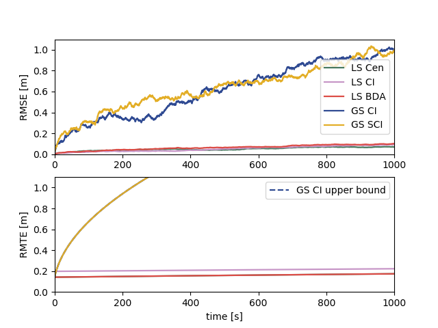
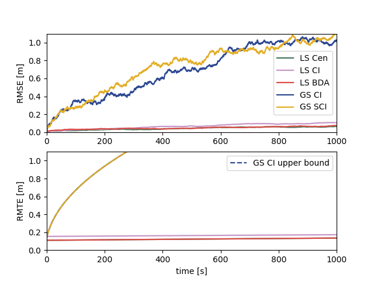

# Multirobot Localization Simulation

This is the simulation code for the paper "Resilient Multirobot Cooperative Localization with Explicit Communication" submitted to *IEEE Transaction on Robotics*.

## Usage

All the simulation parameters are specified in `sim_env.py`. One can specify the random seed here as well.

For GS (global-state) algorithms, one can directly run `gs_ci_sim.py` or `gs_sci_sim.py`.

For LS (local-state) algorithms, one can run `ls_sim.py` with argument `cen`, `bda`, or `ci` to specify which algorithm will be applied.

## Covariance Boundedness

This simulation with motion propagation update only.

This simulation with absolute obervation only.

This simulation uses the topology presented in our paper.

## Topology

## TODO

- generalize the number of robots